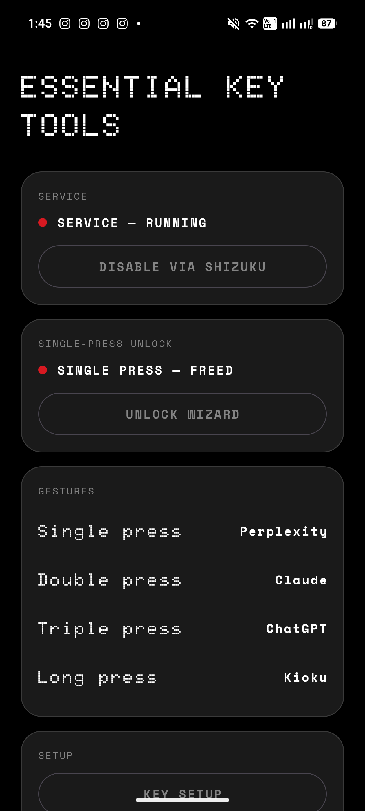
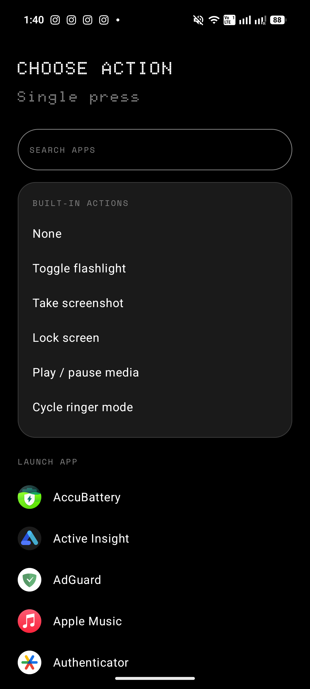
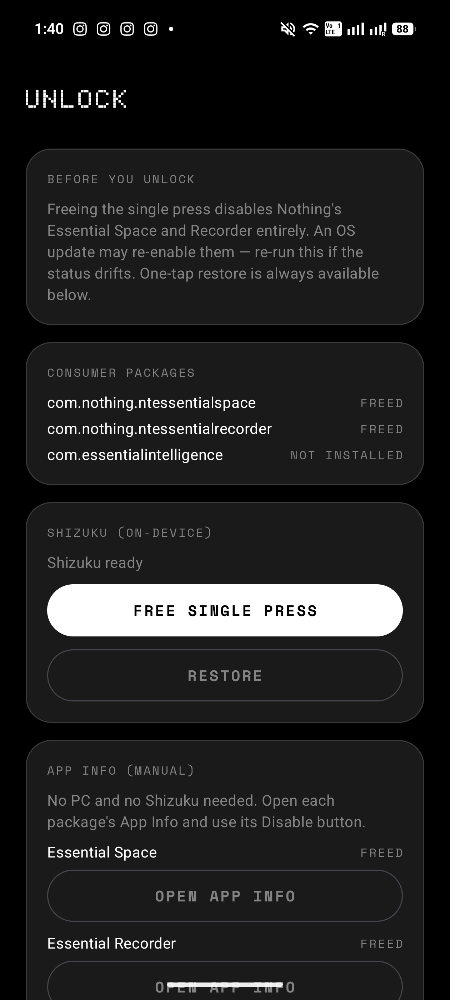
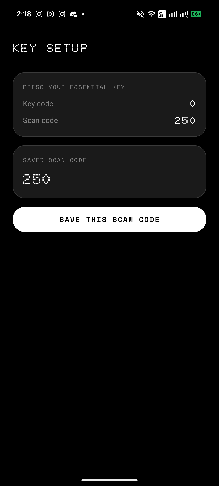
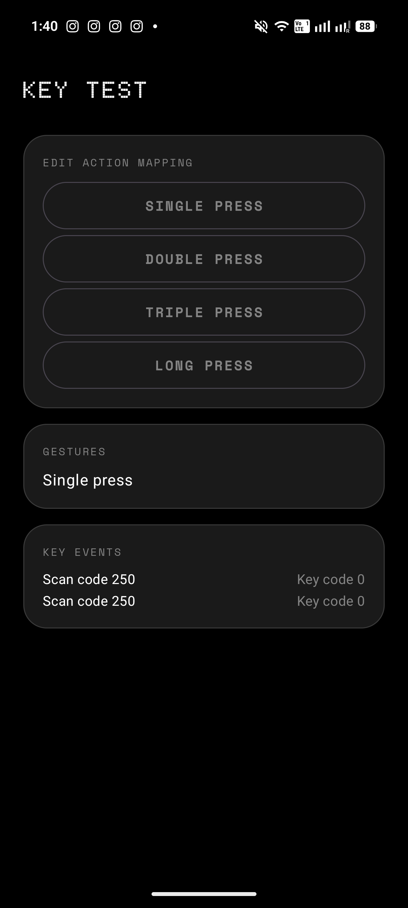

# Essential Key Tools

Remap the Nothing Phone **Essential Key** to your own actions — no root required. The hardware key
enters the input pipeline as `keyCode=0` with Linux `scanCode=250`, which an `AccessibilityService`
can observe. Single / double / triple press and long press each get their own action.

The UI follows the Nothing OS design language: pure-black canvas, flat rounded cards with hairline
outlines, uppercase monospace section labels, and red used at most once per screen.

## Screenshots

<p align="center">
  
  
  
  
  
</p>

## Features

- **Four gestures, four actions** — single, double, triple, long press, each mapped independently.
- **Built-in actions** — launch app, toggle flashlight, take screenshot, lock screen, play/pause
  media, cycle ringer mode.
- **Runtime scanCode learning** — a "press your key" setup flow captures the scanCode instead of
  hard-coding `250`, so it adapts to any model or firmware.
- **In-app service enablement** — a disclosure card explains what the service does, then either a
  **one-tap Shizuku enable/disable** (writes the secure setting directly, no settings hunt) or a
  deep link that highlights the service in system settings.
- **Single-press unlock wizard** — Nothing OS owns the single press until its consumer packages are
  disabled. Three paths: **Shizuku** (on-device, one tap), **manual** (opens each package's App Info
  page to disable by hand), or **ADB** (copyable commands) — with one-tap restore and live
  per-package status.
- **Searchable action picker** — a search field filters built-in actions and the full app list,
  which renders in one page scroll with no nested list.
- **Live status** — home screen shows whether the accessibility service is running and whether the
  single press is freed, re-checked on resume to catch drift from an OS update.

## Permissions

- **`INTERNET`** — used for one thing only: the home screen's contribution card fetches the
  repository's contributor list from the public GitHub API
  (`api.github.com/repos/KoukeNeko/EssentialKeyTools/contributors`). No account, analytics, or
  tracking is involved. Every other feature works fully offline — if the request fails the card just
  falls back to the repository link.
- **Accessibility service** — observes only your hardware Essential Key to run the mapped action; it
  does not read screen content or monitor any other key (see the in-app disclosure and *Background*
  below).

## Setup

1. **Enable the accessibility service** — the home card walks you through it: read the disclosure,
   then one-tap enable via Shizuku, or jump to the highlighted entry in system settings. The service
   listens only for your hardware key.
2. **Learn your key** — Home → *Key setup* → press the Essential Key → save the captured scanCode.
   Use *Key test* to confirm gestures are classified correctly.
3. **Map actions** — tap any gesture card on the home screen to assign its action.
4. **(Optional) Free the single press** — Home → *Unlock wizard*:
   - **Shizuku path** — install & start [Shizuku](https://shizuku.rikka.app) (works on-device via
     Wireless debugging, no PC), grant permission, tap *Free single press*. *Restore* re-enables the
     packages.
   - **Manual path** — open each Nothing package's App Info page from the wizard and disable it
     there (the Disable button may be greyed out on some builds — use Shizuku or ADB then).
   - **ADB path** — from a PC:
     ```
     adb shell pm disable-user --user 0 com.nothing.ntessentialspace
     adb shell pm disable-user --user 0 com.nothing.ntessentialrecorder
     ```
     Revert with `pm enable <pkg>`. The wizard shows the exact copyable commands.

   Freeing the single press disables Nothing's Essential Space and Recorder entirely; an OS update
   may re-enable them. Double / triple / long press work without unlocking.

## Development

Build with the JBR shipped in Android Studio:

```bash
JAVA_HOME="/Applications/Android Studio.app/Contents/jbr/Contents/Home" ./gradlew lint test assembleDebug
```

Or use the verification harness (prints a PASS/FAIL summary, `JAVA_HOME` overridable):

```bash
./scripts/verify.sh
```

`scripts/simulate-key.sh` is a best-effort helper that injects a scancode-250 event via
`adb sendevent` for on-device testing (needs the correct input node and usually root on stock
firmware — see the script's header).

Pure logic (gesture classifier, settings serialization, unlock status/command mapping) is covered by
JVM unit tests and has no Android dependency, so it is verified without a device.

## Background

The interception mechanism builds on community findings: the Essential Key is unmapped in the
public keylayout files (hence `KEYCODE_UNKNOWN`), Nothing OS launches Essential Space from system
policy, and disabling the consumer packages frees the single press for accessibility-based
remapping.


## License

[MIT](LICENSE) © KoukeNeko
