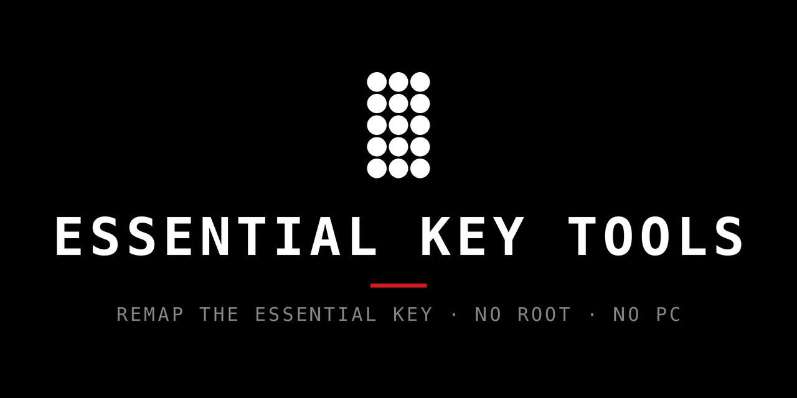

<p align="center">
  
</p>

<p align="center">
  <a href="https://github.com/KoukeNeko/EssentialKeyTools/releases/latest"></a>
  <a href="https://github.com/KoukeNeko/EssentialKeyTools/releases"></a>
  <a href="https://github.com/KoukeNeko/EssentialKeyTools/actions/workflows/build-apk.yml"></a>
  
  
  
  <a href="LICENSE"></a>
  <a href="https://github.com/KoukeNeko/EssentialKeyTools/stargazers"></a>
</p>

Remap the Nothing Phone **Essential Key** to your own actions — no root required. The hardware key
enters the input pipeline as `keyCode=0` with Linux `scanCode=250`, which an `AccessibilityService`
can observe. Single / double / triple press and long press each get their own action.

The UI follows the Nothing OS design language: pure-black canvas, flat rounded cards with hairline
outlines, uppercase monospace section labels, and red used at most once per screen.

## Screenshots

<p align="center">
  
  
  
  
  
</p>

## Install

Download the latest signed APK from
[GitHub Releases](https://github.com/KoukeNeko/EssentialKeyTools/releases/latest). Essential Key
Tools requires Android 15 or newer and is designed for Nothing phones with the Essential Key.

Each stable release includes an APK for direct installation and an AAB for store distribution. The
release notes list the APK's SHA-256 digest and its VirusTotal and Koodous submission status.
Preview APKs use a separate application ID, so they can be installed beside the stable app without
replacing it.

## Features

- **Four gestures, four actions** — single, double, triple, long press, each mapped independently.
- **Built-in actions** — launch app, toggle flashlight, take screenshot, lock screen, play/pause
  media, cycle ringer mode.
- **Runtime scanCode learning** — a "press your key" setup flow captures the scanCode instead of
  hard-coding `250`, so it adapts to any model or firmware.
- **Guided onboarding** — choose a language, review how the app works, then make an explicit choice
  to use or not use the accessibility service.
- **Clear service disclosure** — a dedicated page explains the information received, how it is
  used, what is stored, and what happens after consent before Android settings can open.
- **Single-press unlock wizard** — Nothing OS owns the single press until its consumer packages are
  disabled. The wizard opens each package's App Info page for manual disable or restore and shows
  live per-package status.
- **Safe key testing** — Key Test displays detected events and classified gestures without running
  the action assigned to them.
- **Searchable action picker** — a search field filters built-in actions and the full app list,
  which renders in one page scroll with no nested list.
- **Live status** — home screen shows whether the accessibility service is running and whether the
  single press is freed, re-checked on resume to catch drift from an OS update.
- **Source-aware update checks** — a manual home-screen check uses Google Play for Play-installed
  builds, stable GitHub Releases for sideloaded production builds, and GitHub pre-releases for
  Preview builds. The app never downloads or installs an APK itself.

## Permissions

- **`INTERNET`** — the home screen's contribution card fetches the repository's contributor list
  from the public GitHub API (`api.github.com/repos/KoukeNeko/EssentialKeyTools/contributors`). A
  separate update request runs only when you press **Check for updates**. No account, analytics, or
  tracking is involved, and the app never downloads or installs an APK itself.
- **Accessibility service** — observes only your hardware Essential Key to run the mapped action; it
  does not read screen content, text fields, or text you type. Key events are processed immediately
  on the device and are not stored, uploaded, or shared. Screenshot and lock-screen actions run only
  when you explicitly assign them to a gesture (see the in-app disclosure and *Background* below).

The app collects no personal data and has no analytics, ads, or tracking. See the full
[Privacy Policy](PRIVACY.md).

## Setup

1. **Complete onboarding** — select the app language, read the introduction, and review the full
   accessibility disclosure.
2. **Choose whether to use accessibility** — the final onboarding page has two explicit choices:
   *Agree: use accessibility service* and *Decline: don't use accessibility service*. Agreeing opens
   Android accessibility settings; declining or pressing Back never enables the service. You can
   review the guide or enable the service later from the home screen.
3. **Learn your key** — Home → *Key setup* → press the Essential Key → save the captured scanCode.
   Use *Key test* to confirm gestures are classified correctly without executing mapped actions.
4. **Map actions** — tap any gesture card on the home screen to assign its action.
5. **(Optional) Free the single press** — Home → *Unlock wizard*:
   - Open each Nothing package's App Info page from the wizard and disable it there. Return to the
     same pages and tap *Enable* if you want to restore the packages. On some OS builds the Disable
     button may be unavailable for system apps.

   Freeing the single press disables Nothing's Essential Space and Recorder entirely; an OS update
   may re-enable them. Double / triple / long press work without unlocking.

## Development

Install Android Studio with the Android SDK and JDK 21 (Android Studio's bundled JBR works). If
your shell does not already use JDK 21, set `JAVA_HOME` to that JDK before building.

macOS / Linux:

```bash
./gradlew lint test assembleDebug
```

Windows PowerShell:

```powershell
.\gradlew.bat lint test assembleDebug
```

On macOS and Linux, the verification harness runs the same quality gate and prints a single
PASS/FAIL summary. It uses `JAVA_HOME` when set, otherwise it detects Android Studio's macOS JBR or
the Java installation on `PATH`:

```bash
./scripts/verify.sh
```

`scripts/simulate-key.sh` is a best-effort helper that injects a scancode-250 event via
`adb sendevent` for on-device testing (needs the correct input node and usually root on stock
firmware — see the script's header).

Pure logic (gesture classifier, settings serialization, and unlock status mapping) is covered by JVM
unit tests and has no Android dependency, so it is verified without a device.

## Background

The interception mechanism builds on community findings: the Essential Key is unmapped in the
public keylayout files (hence `KEYCODE_UNKNOWN`), Nothing OS launches Essential Space from system
policy, and disabling the consumer packages frees the single press for accessibility-based
remapping.

## Support

If Essential Key Tools is useful to you, you can support development:

<a href="https://buymeacoffee.com/doershing"></a>

## License

[MIT](LICENSE) © KoukeNeko
